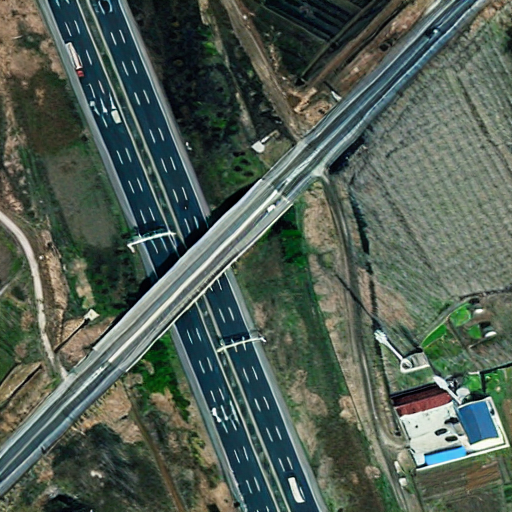
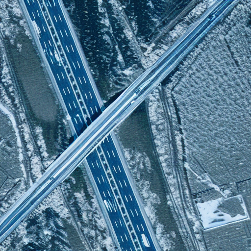

# DST
Disentengled Style Transfer based on diffusion models  
Make [pnp](https://github.com/MichalGeyer/plug-and-play) compatible with style adapter.
## 
<figure class="half">
    
    
</figure>
<!--  -->